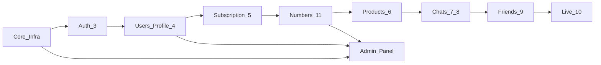

# AnyLang — Global Architecture

**Maqsad:** butun dunyo bo‘ylab ishlaydigan, yuqori yuklamaga chidamli backend + admin.
**Kontrakt manbai:** [Anylang/anylang_backend.md](Anylang/anylang_backend.md)

---

## 1. Texnologiya steki (qulflangan)

### API va runtime
| Qatlam | Tanlov | Nega |
|---|---|---|
| Framework | **FastAPI** (Python 3.12+) | TZ majburiy; async, OpenAPI, yuqori throughput |
| ASGI server | **Uvicorn** + **Gunicorn** (prod) | Production-grade worker pool |
| Validatsiya | **Pydantic v2** | Tez, tip-xavfsiz, `/docs` |
| ORM | **SQLAlchemy 2.x (async)** | Enterprise async ORM |
| Migratsiya | **Alembic** | Versiyalangan sxema |
| Background jobs | **ARQ** (Redis) | Async-native, Redis bilan bir ekosistem |

### Ma’lumotlar
| Qatlam | Tanlov | Nega |
|---|---|---|
| Primary DB | **PostgreSQL 16** | ACID, full-text, JSONB, replication |
| Cache / rate-limit / presence / WS pub-sub | **Redis 7** | Past latency, pub/sub, sorted sets |
| Object storage | **Cloudflare R2** (S3 API) | Global CDN-ga yaqin, egress arzon |
| CDN | **Cloudflare** | WAF, DDoS, edge cache, TLS |

### Xavfsizlik va auth
| Qatlam | Tanlov |
|---|---|
| Password | **argon2-cffi** (argon2id) |
| JWT | **PyJWT** — access 30m, refresh 60d sliding |
| Transport | Faqat **HTTPS / WSS** |
| Secrets | Environment + (prod) Vault / cloud secret manager |
| Rate limit | Redis token-bucket (OTP, search, friends) |

### Tashqi AI / muloqot
| Vazifa | Primary | Fallback |
|---|---|---|
| Tarjima (chat + live) | **DeepL API** | Google Cloud Translation |
| STT (Jonli) | **Deepgram** (past latency) | OpenAI Whisper API |
| TTS (Jonli) | **ElevenLabs** yoki **Azure Neural TTS** | Google Cloud TTS |
| Email (OTP) | **Resend** yoki **AWS SES** | — |
| Google Sign-In | Google `id_token` verify (`google-auth`) | — |

### Admin panel
| Qatlam | Tanlov | Nega |
|---|---|---|
| UI | **Next.js 15** (App Router) + TypeScript | SSR, i18n, enterprise admin |
| UI kit | **shadcn/ui** + Tailwind | Zamonaviy, accessible, tez |
| Data | **TanStack Query** + Zod | Cache, retry, tip-xavfsizlik |
| Auth | Admin JWT (`/api/v1/admin/auth`) | Mobil user tokenidan ajratilgan |

### Observability (global)
| Qatlam | Tanlov |
|---|---|
| Errors | **Sentry** |
| Traces / metrics | **OpenTelemetry** → Grafana / Prometheus |
| Logs | Structured JSON (stdout) → Loki / CloudWatch |
| Uptime | Health: `/health`, `/ready` |

### Deploy
| Muhit | Stack |
|---|---|
| Local | Docker Compose (API + Postgres + Redis + MinIO/R2 mock) |
| Staging / Prod | Containers → **Kubernetes** (multi-AZ), Cloudflare oldida |
| CI/CD | GitHub Actions — lint, test, migrate, deploy |

---

## 2. Monorepo tuzilishi

```
Anylang/                          # workspace root
├── Anylang/                      # Flutter mobil (mavjud)
├── backend/                      # FastAPI API + WS + workers
│   ├── app/
│   │   ├── main.py
│   │   ├── core/                 # config, security, errors, deps
│   │   ├── db/                   # session, base, redis
│   │   ├── models/               # SQLAlchemy models
│   │   ├── schemas/              # Pydantic I/O
│   │   ├── api/v1/               # routers (auth, users, ...)
│   │   ├── services/             # business logic
│   │   ├── integrations/         # DeepL, Deepgram, S3, email
│   │   ├── ws/                   # WebSocket hub + Redis pub/sub
│   │   └── workers/              # ARQ jobs
│   ├── alembic/
│   ├── tests/
│   ├── Dockerfile
│   └── pyproject.toml
├── admin/                        # Next.js admin panel
│   ├── src/app/
│   ├── src/components/
│   ├── src/lib/api/
│   └── package.json
├── docker-compose.yml
└── ARCHITECTURE.md
```

---

## 3. API konventsiyalari (TZ bilan bir xil)

- Prefiks: `api/v1/`
- Success: **envelope yo‘q** — resurs to‘g‘ridan-to‘g‘ri
- Error: `{ "message", "error_code" }` (+ ixtiyoriy maydonlar, masalan `email`)
- Auth: `Authorization: Bearer <access_token>`
- WS: `wss://host/ws?token=<access_token>` — user_id faqat tokendan
- Maydonlar: `snake_case`

Admin API alohida prefiks: `api/v1/admin/` (faqat `AdminUser` rollari).

---

## 4. Modul bo‘yicha implementatsiya tartibi



1. **Core** — config, DB, Redis, errors, JWT, storage, health  
2. **Auth** — register → verify → login → refresh → Google → password reset  
3. **Users / Business** — me, avatar, business, public profile, verified_badge field  
4. **Subscription** — plans, subscribe (mock payment), cancel, expiry job  
5. **Numbers** — groups seed, catalog, assign on register, reserve/purchase  
6. **Products** — CRUD, images, favorites, top, views  
7. **Chats + Messages** — REST send, WS receive, translation, read receipts  
8. **Friends** — requests state machine, search by number  
9. **Live** — sessions, turns (STT→translate→TTS)  
10. **Admin** — users, badges, block, number groups, product pin/archive  

Hali TZ’da yozilmagan (keyin): Settings/Privacy, Payment webhooks, Push.

---

## 5. Global scale tamoyillari

- **Stateless API** — sessiyalar Redis/DB’da; horizontal scale oson  
- **WS + Redis pub/sub** — multi-worker xabar yetkazish  
- **Read replicas** (keyin) — `GET` yuklamasi uchun  
- **CDN** — avatar, product, chat media, TTS audio  
- **Region-aware AI** — STT/TTS eng yaqin region  
- **Idempotency** — `client_message_id`, `client_turn_id`  
- **Soft deletes** — products archived, messages `is_deleted`  
- **Rate limits** — OTP, number search, friend requests  
- **PII minimal** — telefon yo‘q; email + AnyLang number  

---

## 6. Admin panel asosiy ekranlar (v1)

| Modul | Funksiya |
|---|---|
| Dashboard | Users, active subs, messages/day, live turns |
| Users | Qidiruv, `is_active` block/unblock, `verified_badge` |
| Number groups | Pattern, price, bonus_plan, duration, priority |
| Numbers | Band/rezerv, force-release (support) |
| Products | Pin TOP, archive moderation |
| Subscriptions | Manual grant (support/test) |
| Admins | Rollar: `superadmin`, `moderator`, `support` |

---

## 7. Local ishga tushirish (qisqa)

```bash
docker compose up -d          # postgres, redis, minio
cd backend && uv sync && alembic upgrade head && uvicorn app.main:app --reload
cd admin && npm i && npm run dev
```

API: `http://localhost:8000` · Docs: `/docs` · Admin: `http://localhost:3000`
